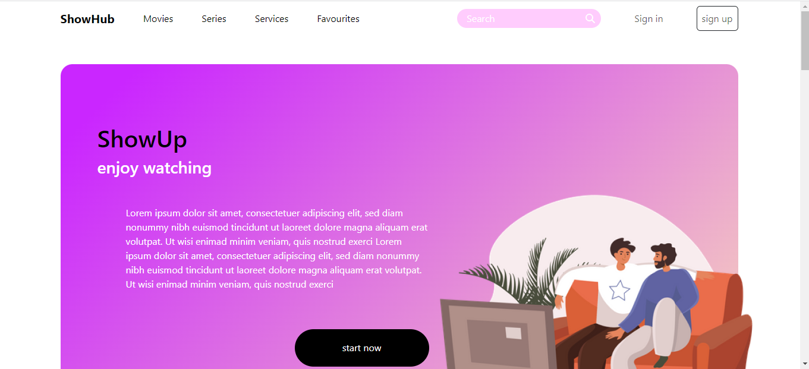
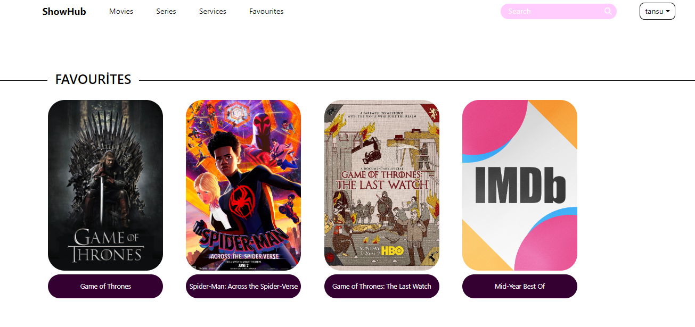
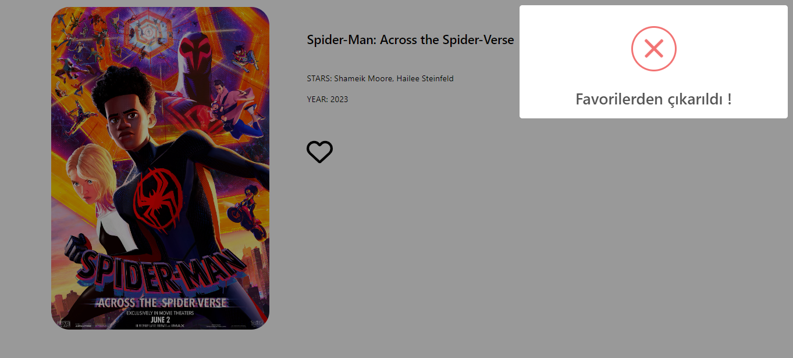

# Movies Website

+ **Tasarım:** NOURDDINE BENYAHYA

+ **Tasarımın linki:** [Figma Community](https://www.figma.com/community/file/1153093357096847391)

## Screenshot

## Kullanılan Teknolojiler

+ React
+ React Router
+ Context API
+ Custom Hooks
+ CSS
+ Bootstrap
+ Json Server

## Kurulum

+ npm install 
+ json-server --watch db.json --port 3030
+ json-server --watch author.json -m ./node_modules/json-server-auth
+ npm run dev

### React + Vite

This template provides a minimal setup to get React working in Vite with HMR and some ESLint rules.

Currently, two official plugins are available:

+ [@vitejs/plugin-react](https://github.com/vitejs/vite-plugin-react/blob/main/packages/plugin-react/README.md) uses [Babel](https://babeljs.io/) for Fast Refresh
+ [@vitejs/plugin-react-swc](https://github.com/vitejs/vite-plugin-react-swc) uses [SWC](https://swc.rs/) for Fast Refresh
